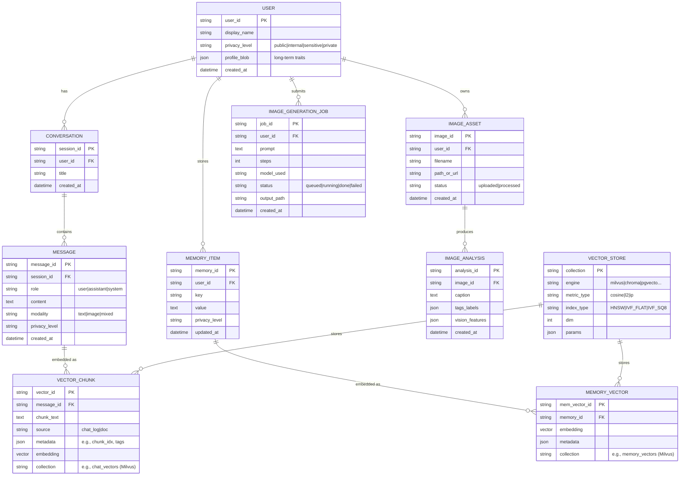

```mermaid
erDiagram
    USER ||--o{ CONVERSATION : "has"
    USER ||--o{ MEMORY_ITEM : "stores"
    USER ||--o{ IMAGE_ASSET : "owns"
    USER ||--o{ IMAGE_GENERATION_JOB : "submits"

    CONVERSATION ||--o{ MESSAGE : "contains"
    MESSAGE ||--o{ VECTOR_CHUNK : "embedded as"

    IMAGE_ASSET ||--o{ IMAGE_ANALYSIS : "produces"

    MEMORY_ITEM ||--o{ MEMORY_VECTOR : "embedded as"

    VECTOR_STORE ||--o{ VECTOR_CHUNK : "stores"
    VECTOR_STORE ||--o{ MEMORY_VECTOR : "stores"

    USER {
      string user_id PK
      string display_name
      string privacy_level  "public|internal|sensitive|private"
      json   profile_blob   "long-term traits"
      datetime created_at
    }

    CONVERSATION {
      string session_id PK
      string user_id FK
      string title
      datetime created_at
    }

    MESSAGE {
      string message_id PK
      string session_id FK
      string role        "user|assistant|system"
      text   content
      string modality    "text|image|mixed"
      string privacy_level
      datetime created_at
    }

    VECTOR_CHUNK {
      string vector_id PK
      string message_id FK
      text   chunk_text
      string source       "chat_log|doc"
      json   metadata     "e.g., chunk_idx, tags"
      vector embedding
      string collection   "e.g., chat_vectors (Milvus)"
    }

    MEMORY_ITEM {
      string memory_id PK
      string user_id FK
      string key
      text   value
      string privacy_level
      datetime updated_at
    }

    MEMORY_VECTOR {
      string mem_vector_id PK
      string memory_id FK
      vector embedding
      json   metadata
      string collection   "e.g., memory_vectors (Milvus)"
    }

    VECTOR_STORE {
      string collection PK
      string engine       "milvus|chroma|pgvecto..."
      string metric_type  "cosine|l2|ip"
      string index_type   "HNSW|IVF_FLAT|IVF_SQ8"
      int    dim
      json   params
    }

    IMAGE_ASSET {
      string image_id PK
      string user_id FK
      string filename
      string path_or_url
      string status       "uploaded|processed"
      datetime created_at
    }

    IMAGE_ANALYSIS {
      string analysis_id PK
      string image_id FK
      text   caption
      json   tags_labels
      json   vision_features
      datetime created_at
    }

    IMAGE_GENERATION_JOB {
      string job_id PK
      string user_id FK
      text   prompt
      int    steps
      string model_used
      string status        "queued|running|done|failed"
      string output_path
      datetime created_at
    }
```
